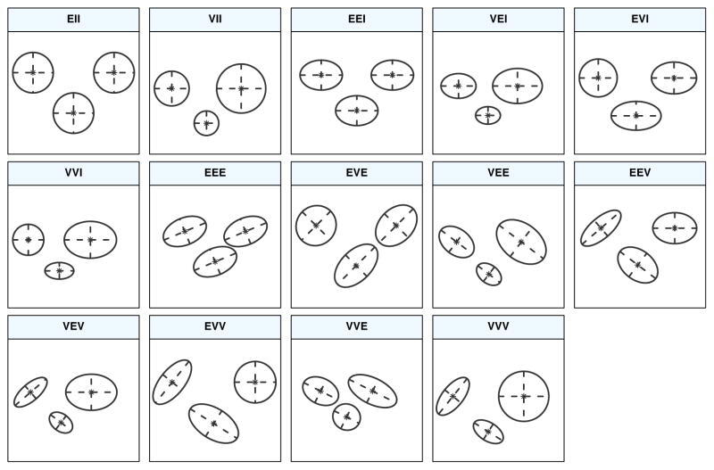

```{r xaringan-themer, include=FALSE, warning=FALSE}
library(xaringanthemer)
style_mono_accent(base_color = "#cc002b")
```

```{r setup, echo = FALSE}
knitr::opts_chunk$set(fig.retina = 3, warning = FALSE, message = FALSE)
```

## Previously...

- We explored the use of __K-means__ and __hierarchical clustering__ for clustering

- These methods yield __hard__ assignments, strictly assigning observations to only one cluster


--
- What about __soft__ assignments? Allow for some __uncertainty__ in the clustering results

--
- Welcome to the wonderful world of __mixture models__


```{r out.width='60%', echo = FALSE, fig.align='center'}
knitr::include_graphics("https://imgs.xkcd.com/comics/t_distribution_2x.png")
```


---

## Previously in kernel density estimation...

$$
\text{Kernel density estimate: } \hat{f}(x) = \frac{1}{n} \sum_{i=1}^n \frac{1}{h} K_h(x - x_i)
$$


--
- We have to use __every observation__ when estimating the density for new points

```{r out.width='60%', echo = FALSE, fig.align='center'}
knitr::include_graphics("https://upload.wikimedia.org/wikipedia/commons/thumb/4/41/Comparison_of_1D_histogram_and_KDE.png/1000px-Comparison_of_1D_histogram_and_KDE.png")
```


--
- Instead we can make __assumptions__ to "simplify" the problem

---

## Mixture models

We assume the distribution $f(x)$ is a __mixture__ of $K$ __component__ distributions:

$$f(x) = \sum_{k=1}^K \pi_k f_k(x)$$

--
- $\pi_k =$ __mixing proportions (or weights)__, where $\pi_k > 0$, and $\sum_k \pi_k = 1$


--
This is a __data generating process__, meaning to generate a new point:

1. __pick a distribution / component__ among our $K$ options, by introducing a new variable: 

  - $z \sim \text{Multinomial} (\pi_1, \pi_2, \dots, \pi_k)$, i.e. categorical variable saying which group the new point is from


--
2. __generate an observation with that distribution / component__, i.e. $x | z \sim f_{z}$


--
_So what do we use for each $f_k$?_


---

## Gaussian mixture models (GMMs)

Assume a __parametric mixture model__, with __parameters__ $\theta_k$ for the $k$th component

$$f(x) = \sum_{k=1}^K \pi_k f_k(x; \theta_k)$$


--
Assume each component is [Gaussian / Normal](https://en.wikipedia.org/wiki/Normal_distribution) where for 1D case:

$$f_k(x; \theta_k) = N(x; \mu_k, \sigma_k^2) = \frac{1}{\sqrt{2\pi \sigma_k^2}}\text{exp} \Big( -\frac{(x - \mu_k)^2}{2 \sigma_k^2} \Big)$$

--
We need to estimate each $\pi_1, \dots, \pi_k$, $\mu_1, \dots, \mu_k$, $\sigma_1, \dots, \sigma_k$!


---

## Let's pretend we only have one component...

If we have $n$ observations from a single Normal distribution, we estimate the distribution parameters using the __likelihood function__, the probability / density of observing the data given the parameters

$$\mathcal{L}(\mu, \sigma | x_1, \dots, x_n) = f( x_1, \dots, x_n | \mu, \sigma) =  \prod_i^n \frac{1}{\sqrt{2\pi \sigma^2}}\text{exp }-\frac{(x_i - \mu)^2}{2 \sigma^2}$$


--
We can compute the __maximum likelihood estimates (MLEs)__ for $\mu$ and $\sigma$

__You already know these values!__

- $\hat{\mu}_{MLE} = \frac{1}{n} \sum_i^n x_i$, sample mean

- $\hat{\sigma}_{MLE} = \sqrt{\frac{1}{n}\sum_i^n (x_i - \mu)^2}$, sample standard deviation (plug in $\hat{\mu}_{MLE}$)

---

## The problem with more than one component...

.pull-left[

- __We don't know which component an observation belongs to__

- __IF WE DID KNOW__, then we could compute each component's MLEs as before

- But we don't know because $z$ is a __latent variable__! So what about its distribution given the data?

$$P(z_i = k | x_i) = \frac{P(x_i | z_i = k) P(z_i = k)}{P(x_i)}$$

$$=\frac{\pi_{k} N\left(\mu_{k}, \sigma_{k}^{2}\right)}{\sum_{k=1}^{K} \pi_{k} N\left(\mu_{k}, \sigma_{k}\right)}$$

- __But we do NOT know these parameters!__

- This leads to a very useful algorithm in statistics...

]

.pull-right[
```{r init-sim-data, echo = FALSE, fig.align='center'}
library(tidyverse)
# mixture components
mu_true <- c(5, 13)
sigma_true <- c(1.5, 2)
# determine Z_i
z <- rbinom(500, 1, 0.75)
# sample from mixture model
x <- rnorm(10000, mean = mu_true[z + 1], 
           sd = sigma_true[z + 1])

tibble(xvar = x) %>%
  ggplot(aes(x = xvar)) +
  geom_histogram(color = "black",
                 fill = "darkblue",
                 alpha = 0.3) +
  theme_bw() +
  labs(x = "Simulated variable",
       y = "Count")
```
]


---

## Expectation-maximization (EM) algorithm

We alternate between the following:

- _pretending_ to know the probability each observation belongs to each group, to estimate the parameters of the components


--
- _pretending_ to know the parameters of the components, to estimate the probability each observation belong to each group


--
__Where have you seen this before?__

--
K-means algorithm!


--
1. Start with initial guesses about $\pi_1, \dots, \pi_k$, $\mu_1, \dots, \mu_k$, $\sigma_1, \dots, \sigma_k$

2. Repeat until nothing changes:


--
- __Expectation__ step: calculate $\hat{z}_{ik}$ = expected membership of observation $i$ in cluster $k$

- __Maximization__ step: update parameter estimates with __weighted__ MLE using $\hat{z}_{ik}$

---

## How does this relate back to clustering?

--
From the EM algorithm:  $\hat{z}_{ik}$ is a __soft membership__ of observation $i$ in cluster $k$

--
  - you can assign observation $i$ to a cluster with the largest $\hat{z}_{ik}$
  
  - measure cluster assignment __uncertainty__ $= 1 - \text{max}_k \hat{z}_{ik}$


--

__Our parameters determine the type of clusters__


--
In 1D we only have two options:


--
1. each cluster __is assumed to have equal variance__ (spread): $\sigma_1^2 = \sigma_2^2 = \dots = \sigma_k^2$


--
2. each cluster __is allowed to have a different variance__


--
_But that is only 1D... what happens in multiple dimensions?_


---

## Multivariate GMMs

$$f(x) = \sum_{k=1}^K \pi_k f_k(x; \theta_k) \\ \text{where }f_k(x; \theta_k) \sim N(\boldsymbol{\mu}_k, \boldsymbol{\Sigma}_k)$$


Each component is a __multivariate normal distribution__:


--
- $\boldsymbol{\mu}_k$ is a _vector_ of means in $p$ dimensions


--
- $\boldsymbol{\Sigma}_k$ is the $p \times p$ __covariance__ matrix - describes the joint variability between pairs of variables

$$\sum=\left[\begin{array}{cccc}
\sigma_{1}^{2} & \sigma_{1,2} & \cdots & \sigma_{1, p} \\
\sigma_{2,1} & \sigma_{2}^{2} & \cdots & \sigma_{2, p} \\
\vdots & \vdots & \ddots & \vdots \\
\sigma_{p, 1} & \sigma_{p, 2}^{2} & \cdots & \sigma_{p}^{2}
\end{array}\right]$$

---

## Covariance constraints

$$\sum=\left[\begin{array}{cccc}
\sigma_{1}^{2} & \sigma_{1,2} & \cdots & \sigma_{1, p} \\
\sigma_{2,1} & \sigma_{2}^{2} & \cdots & \sigma_{2, p} \\
\vdots & \vdots & \ddots & \vdots \\
\sigma_{p, 1} & \sigma_{p, 2}^{2} & \cdots & \sigma_{p}^{2}
\end{array}\right]$$

--

As we increase the number of dimensions, model fitting and estimation becomes increasingly difficult

--

We can use __constraints__ on multiple aspects of the $k$ covariance matrices:


--
- __volume__: size of the clusters, i.e., number of observations, 

- __shape__: direction of variance, i.e. which variables display more variance

- __orientation__: aligned with axes (low covariance) versus tilted (due to relationships between variables)

---

```{r out.width='70%', echo = FALSE, fig.align='center'}

```

- Control volume, shape, orientation

- __E__ means equal and __V__ means variable (_VVV_ is the most flexible, but has the most parameters)

- Two II is __spherical__, one I is __diagonal__, and the remaining are __general__

---

## So many options! How do we know what to do?

```{r out.width='70%', echo = FALSE, fig.align='center'}
knitr::include_graphics("https://i.pinimg.com/originals/c8/d5/0e/c8d50e648631eb60535305d2da3ceb2a.gif")
```

---

## Bayesian information criterion (BIC)

__This is a statistical model__

$$f(x) = \sum_{k=1}^K \pi_k f_k(x; \theta_k) \\ \text{where }f_k(x; \theta_k) \sim N(\boldsymbol{\mu}_k, \boldsymbol{\Sigma}_k)$$


--
Meaning we can use a __model selection__ procedure for determining which best characterizes the data


--
Specifically - we will use a __penalized likelihood__ measure

$$BIC = 2\log \mathcal{L} - m\log n$$

- $\log \mathcal{L}$ is the log-likelihood of the considered model

- with $m$ parameters (_VVV_ has the most parameters) and $n$ observations


--
- __penalizes__ large models with __many clusters without constraints__

- __we can use BIC to choose the covariance constraints AND number of clusters $K$!__

_The above BIC is really the -BIC of what you typically see, this sign flip is just for ease_


---

### Mixture model for NBA players... New dataset!

Created dataset of NBA player statistics per 100 possessions using [`ballr`](https://cran.r-project.org/web/packages/ballr/vignettes/use-ballr.html)

```{r load-data, warning = FALSE, message = FALSE}
library(tidyverse)
nba_pos_stats <- 
  read_csv("https://shorturl.at/mFGY2")
# Find rows for players indicating a full season worth of stats
tot_players <- nba_pos_stats %>% filter(tm == "TOT")
# Stack this dataset with players that played on just one team
nba_player_stats <- nba_pos_stats %>% 
  filter(!(player %in% tot_players$player)) %>% 
  bind_rows(tot_players)
# Filter to only players with at least 125 minutes played
nba_filtered_stats <- nba_player_stats %>% filter(mp >= 125)
head(nba_filtered_stats)
```

---

## Gaussian Mixture Models with [`mclust`](https://cran.r-project.org/web/packages/mclust/vignettes/mclust.html)

Use the `Mclust` function to search over 1 to 9 clusters (_K_ = `G`) and the different covariance constraints (i.e. models) 

```{r nba-mclust, eval = FALSE}
library(mclust)
nba_mclust <- Mclust(dplyr::select(nba_filtered_stats, x3pa, trb))
```

```{r ref.label = 'nba-mclust', include = FALSE}
#nba_mclust <- Mclust(dplyr::select(nba_filtered_stats, x3pa, trb))
```

We can use the `summary()` function to display the selection and resulting table of assignments:

```{r nba-mclust-summary}
summary(nba_mclust)
```


---

## Display the BIC for each model and number of clusters

.pull-left[
```{r nba-bic, fig.align = 'center', fig.height=6}
plot(nba_mclust, what = 'BIC', 
     legendArgs = list(x = "bottomright", 
                       ncol = 4))
```
]
.pull-right[
```{r nba-cluster-plot, fig.height=6} 
plot(nba_mclust, what = 'classification')
```
]

---

## How do the cluster assignments compare to the positions?

We can again compare the clustering assignments with player positions:

```{r nba-table}
table("Clusters" = nba_mclust$classification, "Positions" = nba_filtered_stats$pos)
```

---

## What about the cluster probabilities?

.pull-left[
```{r nba-probs, eval = FALSE}
nba_player_probs <- nba_mclust$z #<<
colnames(nba_player_probs) <- 
  paste0('Cluster ', 1:3)

nba_player_probs <- nba_player_probs %>%
  as_tibble() %>%
  mutate(player = 
           nba_filtered_stats$player) %>%
  pivot_longer(contains("Cluster"), #<<
               names_to = "cluster", #<<
               values_to = "prob") #<<

nba_player_probs %>%
  ggplot(aes(prob)) +
  geom_histogram() +
  theme_bw() +
  facet_wrap(~ cluster, nrow = 2)

```
]
.pull-right[
```{r ref.label='nba-probs', echo=FALSE}

```
]

---

## Which players have the highest uncertainty?

.pull-left[
```{r nba-uncertainty, eval = FALSE}
nba_filtered_stats %>%
  mutate(cluster = #<<
           nba_mclust$classification, #<<
         uncertainty = #<<
           nba_mclust$uncertainty) %>%#<<
  group_by(cluster) %>%
  arrange(desc(uncertainty)) %>%
  slice(1:5) %>%
  ggplot(aes(y = uncertainty, 
             x = reorder(player, #<<
                         uncertainty))) +#<<
  geom_point() +
  coord_flip() + 
  theme_bw() +
  facet_wrap(~ cluster, 
             scales = 'free_y', nrow = 3)

```
]
.pull-right[
```{r ref.label='nba-uncertainty', echo=FALSE}

```
]


